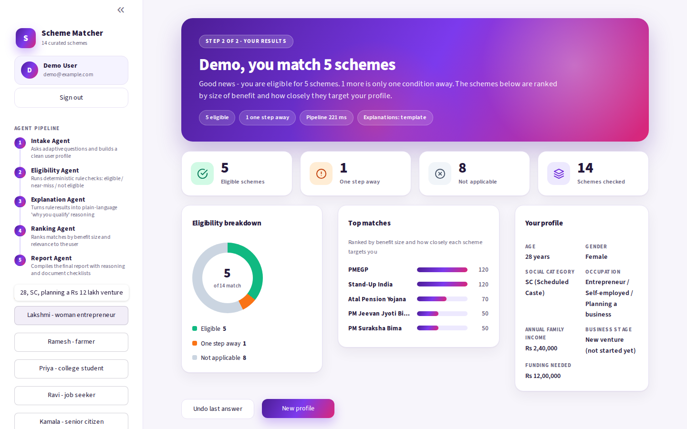
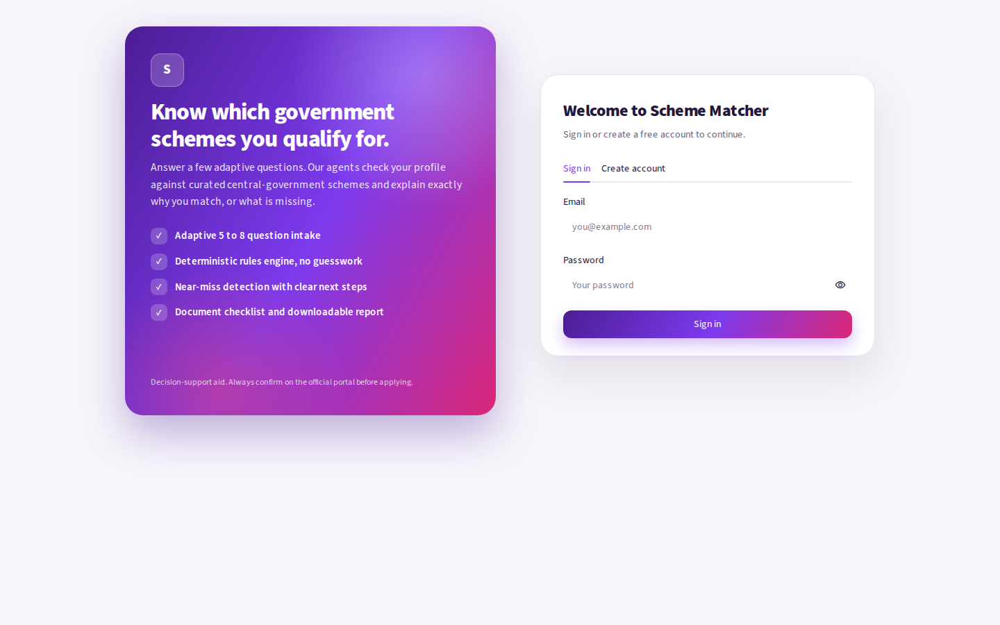
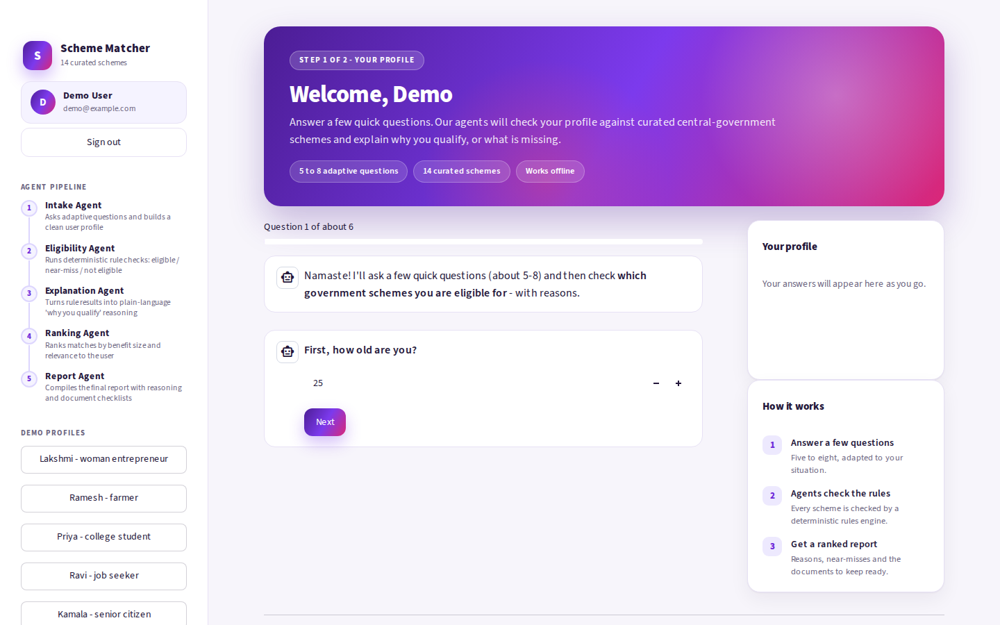
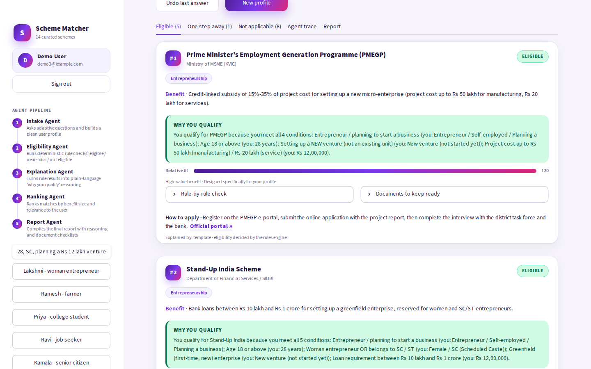
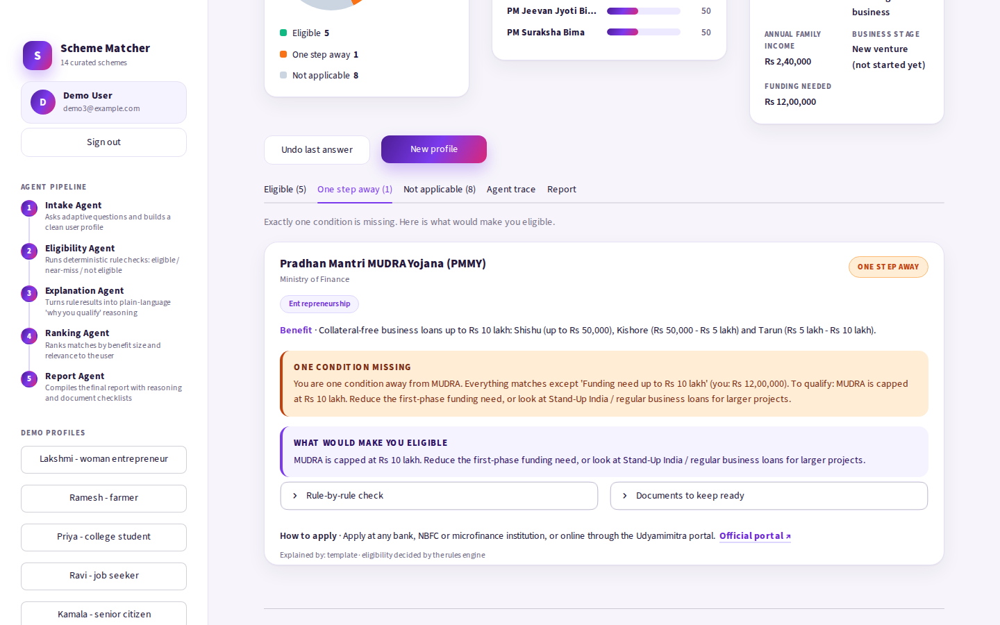

# Government Scheme Matcher

A multi-agent assistant that asks a citizen 5-8 adaptive questions, checks
their profile against 14 curated central-government schemes, and explains
**why** they qualify, what is **one step away**, and which **documents** to
keep ready.

Built for the Capabl **National Level Agentic AI Hackathon** (Track A,
problem statement A4). Python · Streamlit · deterministic rules engine ·
optional LLM explanations · 31 unit tests.

**Live demo:** https://scheme-matcher-ai-swnkmxhitt996chdbgervt.streamlit.app/

## Screenshots

**Results dashboard** - eligibility summary, top matches ranked by benefit, and the captured profile.



| Sign in | Adaptive intake |
|---|---|
|  |  |

| Eligible schemes with reasons | Near-miss: one step away |
|---|---|
|  |  |

## The problem

India has hundreds of welfare and financing schemes, but eligibility rules
are scattered across portals and written in dense language. People miss
benefits they already qualify for - or give up on ones they are one
document away from.

## Design principle

**Rules decide, the LLM only explains.** Eligibility is always computed by a
deterministic, unit-tested rules engine. An LLM (Anthropic or OpenAI, if a
key is provided) only rewrites verified rule results into friendlier
language - so it can't invent eligibility. Without a key, the app runs fully
offline using template explanations.

---

## Quick start (VS Code)

**Requirements:** Python 3.10 or newer.

1. Clone the repo and open the folder in VS Code (`File → Open Folder…`):
   ```bash
   git clone https://github.com/SobhanaAishwarya/Scheme-matcher-ai.git
   cd Scheme-matcher-ai
   ```
2. Open a terminal in VS Code (`Ctrl + ~`) and run:

**Windows**
```bash
python -m venv .venv
.venv\Scripts\activate
pip install -r requirements.txt
streamlit run app.py
```

**macOS / Linux**
```bash
python3 -m venv .venv
source .venv/bin/activate
pip install -r requirements.txt
streamlit run app.py
```

> Shortcut: double-click `run.bat` (Windows) or run `./run.sh` (macOS/Linux) - it does all of the above.

The app opens at **http://localhost:8501**. You will see a short emoji splash, then a sign-in page: choose
**Create account** (any email and a password of 8+ characters) to continue.
If Streamlit asks for an email on first launch, just press **Enter**.

### Optional: enable LLM explanations
```bash
pip install -r requirements-llm.txt
copy .env.example .env        # (macOS/Linux: cp .env.example .env)
# put ONE key inside .env  →  ANTHROPIC_API_KEY=...   or   OPENAI_API_KEY=...
```
You can also paste a key in the app: **sidebar → LLM settings**. If the LLM call ever fails, the app
automatically falls back to template explanations (shown in the Agent trace).

### Run the tests
```bash
python -m unittest discover -s tests -v
```

---

## How it works (the agentic pipeline)

```
 User answers        ┌──────────────┐   ┌───────────────────┐   ┌───────────────────┐
 (adaptive Q&A) ───► │ Intake Agent │──►│ Eligibility Agent │──►│ Explanation Agent │
                     └──────────────┘   │  (rules engine)   │   │  (LLM / template) │
                                        └───────────────────┘   └─────────┬─────────┘
                                                                          ▼
                                      ┌──────────────┐   ┌───────────────────────────┐
                                      │ Report Agent │◄──│       Ranking Agent       │
                                      │ (MD + PDF)   │   │ (benefit + targeting)     │
                                      └──────────────┘   └───────────────────────────┘
```

| Agent | Job |
|---|---|
| **Intake Agent** | Adaptive questions (a farmer is asked about land, a student about education & marks, an entrepreneur about business stage & funding). Validates and cleans the profile. |
| **Eligibility Agent** | Runs every rule of every scheme → **eligible / near-miss / not eligible**. Deterministic, testable. |
| **Explanation Agent** | Writes the “why you qualify” text from verified rule results. Uses an LLM if a key exists, otherwise templates. |
| **Ranking Agent** | Score = benefit size × 10 + how specifically the scheme targets the user × 10. |
| **Report Agent** | Builds a downloadable PDF / Markdown report with reasoning and document checklists. |

The **Agent trace** tab in the UI shows every agent step with timing - this is what makes the system
*agentic and explainable* rather than a plain prompt-to-answer chatbot.

### Feature checklist (from the problem statement)

| Requirement | Where |
|---|---|
| Conversational profile intake (5-8 questions) | `scheme_matcher/questions.py`, chat UI in `app.py` |
| Adaptive questions based on prior answers | `ask_if` conditions in `questions.py` |
| Rule-based eligibility checking on curated schemes | `rules_engine.py`, `data/schemes.json` |
| Reasoning shown for each match ("why you qualify") | Explanation Agent + rule-by-rule expander |
| Near-miss detection ("what would make you eligible") | `near_miss` status + Near-miss tab |
| Ranking by relevance / benefit | `ranking_agent.py` |
| **Compulsory add-on: required-documents checklist** | `documents` field per scheme, tick-able checklist in each card, included in the report |

---

## Project structure

```
Scheme-matcher-ai/
├── app.py                      # Streamlit UI (chat intake, results, trace, report)
├── data/schemes.json           # 14 curated schemes: rules, benefit, documents, apply links
├── scheme_matcher/
│   ├── constants.py            # option lists + formatting (Indian number format)
│   ├── questions.py            # adaptive question flow
│   ├── rules_engine.py         # deterministic eligibility + near-miss logic
│   ├── llm.py                  # optional Anthropic/OpenAI wrapper
│   ├── orchestrator.py         # runs the agent pipeline over shared state
│   ├── personas.py             # demo personas
│   ├── auth.py, db.py          # sign up / sign in (PBKDF2 password hashes in SQLite)
│   ├── ui/                     # theme (CSS), HTML components, splash + sign-in gate
│   └── agents/                 # intake, eligibility, explanation, ranking, report
├── tests/                      # unit tests: rules engine, pipeline, auth
├── requirements.txt / requirements-llm.txt / .env.example
└── run.bat / run.sh
```

## Schemes included (14)

PMEGP · MUDRA · Stand-Up India · PM-KISAN · Kisan Credit Card · Post-Matric Scholarship (SC) ·
Post-Matric Scholarship (ST) · PM YASASVI (OBC) · Central Sector Scholarship · PMKVY ·
Ayushman Vay Vandana · Atal Pension Yojana · PM Jeevan Jyoti Bima · PM Suraksha Bima

### Adding a scheme
Add an object to `data/schemes.json`. Rules are simple data:
```json
{"field": "income", "op": "lte", "value": 250000, "label": "Family income up to Rs 2.5 lakh",
 "fixable": true, "hint": "Family income must not exceed Rs 2.5 lakh per year."}
```
Operators: `eq, ne, in, not_in, gte, lte, gt, lt, between`, plus `{"any_of": [...]}` for OR conditions.
`fixable: true` means the user could plausibly close that gap → it can trigger a **near-miss**.
No code changes are needed.

---

## Try it quickly

Use the sidebar **Demo personas** (e.g. Lakshmi, Priya) to load a synthetic profile instantly - both show near-miss results.

## Limitations & next steps
* Dataset is **simplified** for a hackathon demo (14 schemes, no state-specific rules). Always verify on official portals - links are inside each card.
* Uses **synthetic personas only** - no real personal data is collected or stored.
* Accounts live in a local SQLite file (`data/users.db`, git-ignored) with salted PBKDF2 password hashes. On hosts with an
  ephemeral disk, such as Streamlit Community Cloud, accounts reset whenever the app restarts.
* Future work: state-specific schemes, multilingual (Telugu/Hindi) chat + voice, live scheme-data sync from MyScheme.gov.in, LangGraph-based orchestration.

## Troubleshooting
| Problem | Fix |
|---|---|
| `streamlit: command not found` | Activate the venv first (`.venv\Scripts\activate`), then `pip install -r requirements.txt`. |
| PDF button missing | `pip install reportlab` (Markdown download still works). |
| LLM explanations not used | Check the sidebar status, or the “Agent trace” tab for the error; the app falls back to templates automatically. |
| Port already in use | `streamlit run app.py --server.port 8502` |

---

© 2026 Kantapalli Sobhana Aishwarya. All rights reserved. Shared for portfolio viewing; please ask before reusing.
